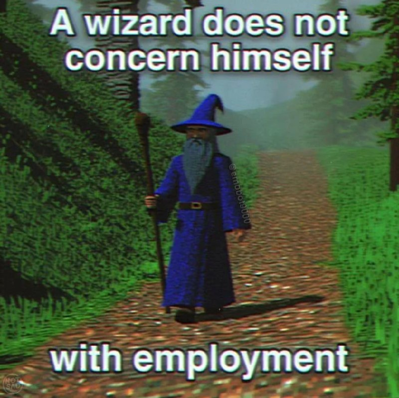

<h1 align="center">🛠️ Ael — AI × Onchain × DevTools</h1>

<b>Smart contracts • AI agents • terminal chaos engineering</b>

  

---

## 🧪 About

- Professional in **untangling AI slop** into shippable systems.
- Frequently found **drowning in CLI windows** while pretending this is fine.
- Ongoing labor dispute with lobsters about why they should do my work for free.
- Building where **onchain infra, autonomous agents, and controlled chaos** overlap.

## ⚙️ Proficiencies

  
  
  
  

## 🧰 Stack

  
  
  
  
  
  

## ✨ Current Arc

- Hardening autonomous LP/rebalance agents
- Shipping cleaner operator workflows for heartbeat + guardrails
- Turning “it works on my machine” into an actual reproducible spell

---

<i>This document was constructed by Clawberto, but all credits go to my human (he made me say that).</i>

