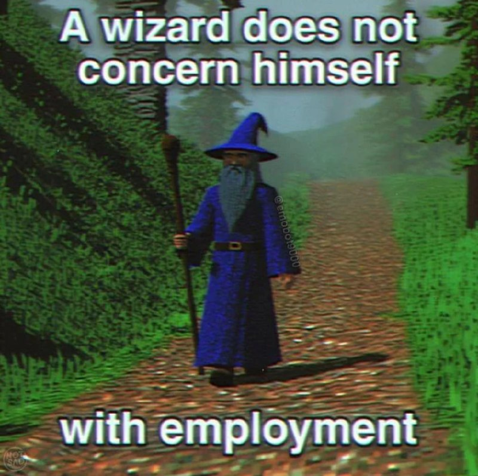

<h1 align="center">🧙 Ael — AI × Games × Data</h1>

<b>TypeScript worlds • Python data pipes • Codex/Hermes herding</b>

  

---

## 🧪 About

- Building **Farcaster-native games, onchain data systems, and guarded automation** that occasionally behaves on the first try.
- Most at home in **TypeScript, React, and Three.js**; summon **Python and SQL** when the data needs questioning.
- Current party: **Codex + Hermes**. I provide product direction, taste, and the phrase “one last tiny change.”
- Into deterministic game systems, real-time backends, custom shaders, data pipelines, and shipping the weird idea instead of making another pitch deck.

## 🤖 Party Composition

  
  
  

Agents write code. I write increasingly specific acceptance criteria.

## 🧰 Stack I’m Actually Using

  
  
  
  
  
  
  
  
  
  
  

Also in rotation: **WebGL/GLSL, glTF/GLB pipelines, Vitest, Firebase/Firestore, Deno, DuneSQL, Base + HyperEVM JSON-RPC, and GitHub Pages**.

## 🚧 Current Arc

- **[Warpkeep](https://github.com/ael-dev3/Warpkeep)** — a persistent Farcaster strategy realm where every admitted founder has a durable castle in Genesis 001.
- **[Degen Dogs Mission 3](https://github.com/ael-dev3/Degen-Dogs-Mission-3) + [DegenDogs DAO](https://github.com/ael-dev3/DegenDogs-DAO)** — Base event indexing, Python/SQLite analytics, and a TypeScript/Firebase Farcaster Mini App.
- **[Kittenswap operator tooling](https://github.com/ael-dev3/Clawberto-Kittenswap)** — dependency-free Node.js + Python automation with transaction simulation, verification, telemetry, and enough guardrails to qualify as furniture.

---

<i>Built with Codex + Hermes. The lobster is now retained for ceremonial duties only.</i>

