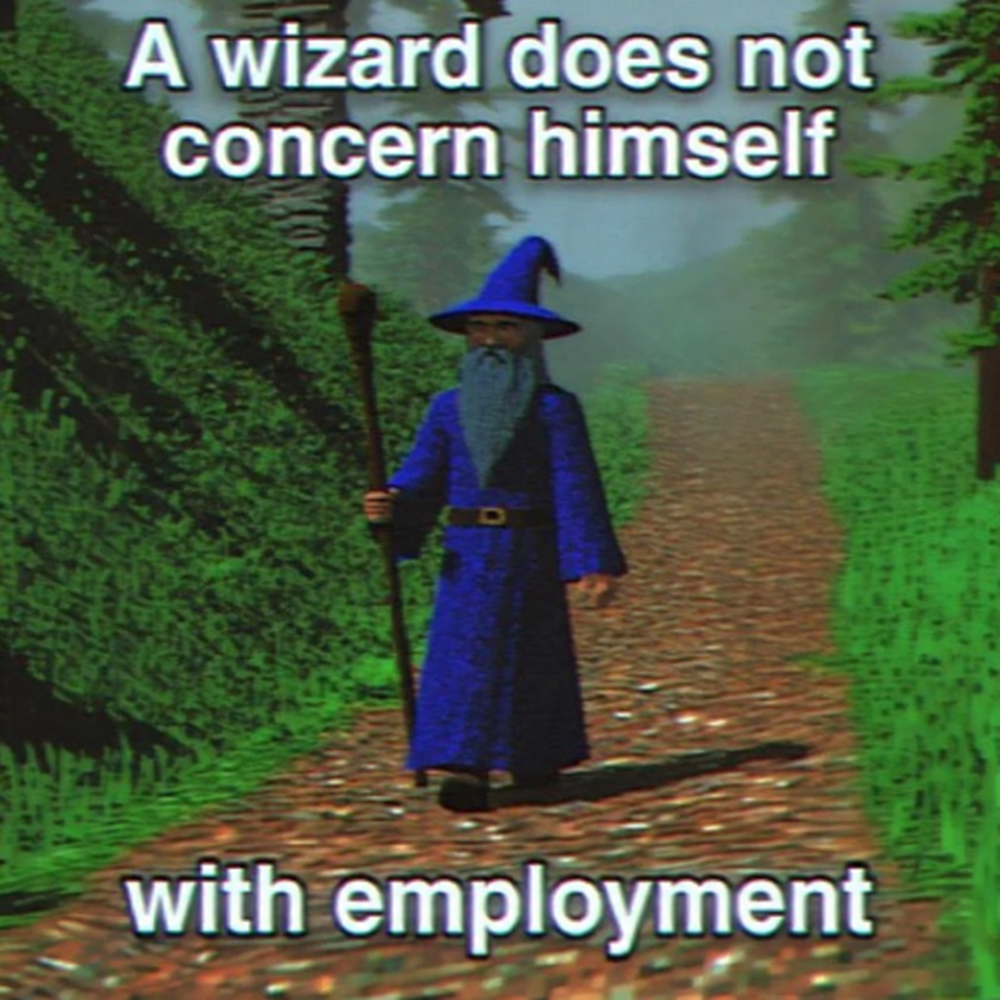
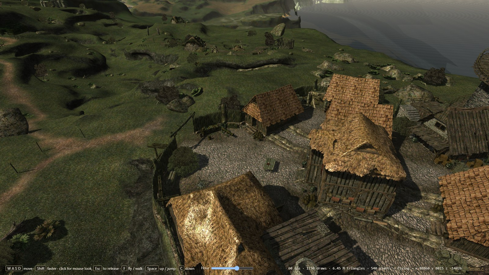
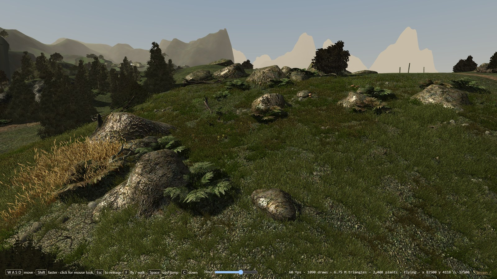

<h1 align="center">Hi, I'm Ael</h1>

  

## Warpkeep

I'm building a persistent strategy game where you gather resources and make
a keep your own. An early alpha is live, and I'm working on the next version.

[Website](https://warpkeep.com/) · [Published Alpha](https://github.com/ael-dev3/Warpkeep-Live)

## Gothic 3, from your own copy

[Tervain](https://github.com/ael-dev3/Tervain) is my single-player high-fantasy
RPG, in pre-production with a browser prototype. As study material for it, I
built a viewer that draws Gothic 3's Ardea in the browser straight from an
installed copy of the game. It reads the archives in your browser tab; no game
files are hosted.

[Open the viewer](https://ael-dev3.github.io/Tervain/gothic3-local/) with your own Gothic 3 · [How it works](https://github.com/ael-dev3/Tervain/blob/main/docs/engineering/gothic3-local.md)

  
  
  
  

Gothic 3 © THQ Nordic GmbH, developed by Piranha Bytes. Screenshots of the viewer drawing a locally installed copy; not affiliated with or endorsed by them.

## A few other projects

- **[Ashen Hallow](https://github.com/ael-dev3/Ashen-Hallow)** — a fantasy autobattler you can play in your browser. Build an army and choose how it lines up for battle. [Play](https://ael-dev3.github.io/Ashen-Hallow/).
- **[Degen Dogs](https://github.com/ael-dev3/Degen-Dogs-Mission-3)** — community auction analytics on Base, with searchable history and downloadable data. [Dashboard](https://ael-dev3.github.io/Degen-Dogs-Mission-3/).
- **[Lyrics](https://github.com/ael-dev3/lyrics)** — lyric videos, English translations, and visuals that follow the music.

## Behind the projects

[Gameplay tests](https://github.com/ael-dev3/Ashen-Hallow/blob/main/scripts/testGameplayScenarios.ts) ·
[Dashboard rebuild guide](https://github.com/ael-dev3/Degen-Dogs-Mission-3/blob/main/reconstruction/README.md) ·
[Lyric film verification](https://github.com/ael-dev3/lyrics/blob/main/projects/vedmy-lyric-film/evidence/final-verification.md)

[More projects](PROJECTS.md)

[Website](https://warpkeep.com/) · [Farcaster](https://farcaster.xyz/0xael.eth) · [X](https://x.com/0xAell)
